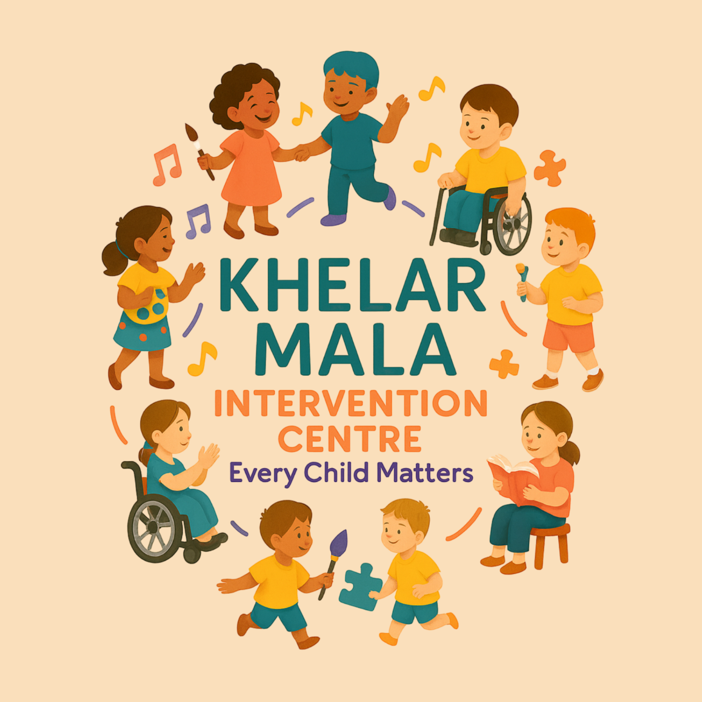

<p align="center">
  
</p>

<h1 align="center">Khelar Mala — Where Play Meets Progress</h1>

<p align="center">
  <em>খেলার মালা • Garland of Play</em>
</p>

<p align="center">
  <strong>North Bengal's most trusted intervention centre for children with special needs.</strong><br />
  Nurturing potential through Play Therapy since 1997.
</p>

<p align="center">
  <a href="https://www.khelarmala.in">🌐 Website</a> •
  <a href="https://www.instagram.com/khelarmala">📸 Instagram</a> •
  <a href="https://www.facebook.com/share/1FZMHwKAJJ/">📘 Facebook</a> •
  <a href="https://x.com/khelarmala">🐦 X (Twitter)</a> •
  <a href="https://wa.me/919474905039?text=Hello%20Khelar%20Mala!%20I%20would%20like%20to%20inquire%20about%20your%20services.">💬 WhatsApp</a>
</p>

<p align="center">
  
  
  
  
</p>

---

## 🌟 About Khelar Mala

**Khelar Mala Intervention Centre** (খেলার মালা) — meaning *"Garland of Play"* in Bengali — is a specialized facility dedicated to the holistic development of children with special needs.

Founded in **1997** by **Sucharita Dasgupta**, a passionate Special Educator, what began as a small initiative has grown into North Bengal's most trusted destination for holistic child development. For over **27 years**, we have been weaving together different therapeutic approaches into one beautiful, unified experience for each child — just as a garland brings together individual flowers to create something greater.

> *"Within every child resides infinite possibility — we simply illuminate the path."*
> — **Sucharita Dasgupta**, Founder & Director

## 🎯 Our Philosophy

At the heart of everything we do is one powerful belief: **Every Child Matters**.

We see ability, not disability. We celebrate progress over perfection. And we believe that when parents and professionals work together, extraordinary growth becomes possible.

**Our Core Values:**
- **Every Child Matters** — inherent worth and unlimited potential
- **Play is Powerful** — a child's natural language for learning and growth
- **Families are Foundational** — parents as essential partners in the journey
- **Progress Over Perfection** — celebrating every milestone, big or small
- **Holistic Growth** — nurturing the whole child: mind, body, and heart

## 🧩 Our Approach — Play Therapy

Play Therapy is the umbrella under which all our specialized therapies unite. Like a great tree with deep roots and many branches, our approach provides a strong foundation while addressing each child's unique needs.

**Every game has a purpose. Every activity has a goal. Every moment of play becomes an opportunity for growth.**

### 9 Specialized Therapies

| Therapy | Focus Area |
|---------|-----------|
| 🎨 **Art Therapy** | Fine motor development, creative expression, emotional confidence |
| 💃 **Dance Therapy** | Coordination, balance, body awareness, physical self-expression |
| 🎵 **Music Therapy** | Auditory skills, memory enhancement, emotional connection |
| 📖 **Language Therapy** | Vocabulary growth, comprehension, meaningful communication |
| 🗣️ **Speech Therapy** | Articulation, fluency, confident spoken communication |
| 🧠 **Cognitive Therapy** | Attention span, problem-solving, academic readiness |
| 🤲 **Occupational Therapy** | Motor control, daily independence, self-care skills |
| 💚 **Behavioral Therapy** | Positive behavior, social understanding, self-control |
| 🧘 **Yoga & Meditation** | Flexibility, focus, emotional self-regulation |

## 👨‍👩‍👧 Children We Care For

We welcome children with a wide range of developmental, learning, and behavioral differences:

- Autism Spectrum Disorder (ASD)
- ADHD / ADD / ODD
- Learning Disabilities
- Hearing Impairment
- Speech & Language Disorders
- Cerebral Palsy
- Intellectual Impairment
- Down Syndrome
- Multiple Disabilities
- Global Developmental Delay
- Sensory Processing Disorder
- Developmental Coordination Disorder

*Not sure where your child fits? Every child is unique — reach out for a conversation.*

## 🤝 Parents as Partners

Unlike traditional therapy centres, at Khelar Mala parents actively participate in every step of the therapeutic journey. This unique **Parent-Child Partnership Model** ensures:

- **Faster Progress** — practice continues at home
- **Stronger Bonds** — shared activities strengthen relationships
- **Empowered Families** — parents gain skills and confidence
- **Seamless Continuity** — learning extends beyond therapy sessions

## 🏗️ Tech Stack

This website is built with a modern, performant frontend stack:

| Technology | Purpose |
|-----------|---------|
| [React 18](https://react.dev) | UI library |
| [TypeScript](https://www.typescriptlang.org) | Type safety |
| [Vite](https://vite.dev) | Build tool & dev server |
| [Tailwind CSS](https://tailwindcss.com) | Utility-first styling |
| [shadcn/ui](https://ui.shadcn.com) | Component library |
| [Radix UI](https://www.radix-ui.com) | Accessible primitives |
| [Framer Motion](https://www.framer.com/motion) | Animations & transitions |
| [React Router](https://reactrouter.com) | Client-side routing |
| [React Helmet Async](https://github.com/staylor/react-helmet-async) | SEO meta tags |
| [next-themes](https://github.com/pacocoursey/next-themes) | Dark / Light mode |
| [Lucide React](https://lucide.dev) | Icon library |

## 🚀 Getting Started

### Prerequisites

- [Node.js](https://nodejs.org) v18 or higher
- npm or yarn

### Installation

```bash
# Clone the repository
git clone https://github.com/kwa-sac/playful-progress-hub.git

# Navigate to the project
cd playful-progress-hub

# Install dependencies
npm install

# Start the development server
npm run dev
```

The site will be available at `http://localhost:5173`

### Build for Production

```bash
# Build the project
npm run build

# Preview the production build locally
npm run preview
```

The optimized output will be in the `dist/` directory.

## 📁 Project Structure

```
src/
├── assets/              # Images, illustrations, logos
├── components/
│   ├── layout/          # Header, Footer, Layout, WhatsApp button
│   ├── sections/        # Homepage sections (Hero, About, Therapies, etc.)
│   ├── features/        # Chatbot and other features
│   └── ui/              # shadcn/ui components
├── hooks/               # Custom React hooks
├── lib/                 # Constants, utilities
├── pages/               # Route pages (Home, About, Approach, etc.)
├── App.tsx              # Root component with routing
├── index.css            # Global styles & theme variables
└── main.tsx             # Entry point
```

## 🌗 Theme Support

The website supports **Light** and **Dark** mode with carefully crafted color palettes for each:

- **Light Mode** — warm cream backgrounds, deep teal accents, amber/gold highlights
- **Dark Mode** — deep navy tones, brighter teal accents, warm gold highlights

Theme preference is persisted across sessions.

## 🌐 Deployment

The site is deployed on **Vercel** with automatic deployments on every push to `main`.

**Custom Domain:** [www.khelarmala.in](https://www.khelarmala.in)

### Deploy Your Own

[](https://vercel.com/new/clone?repository-url=https://github.com/kwa-sac/playful-progress-hub)

## 📞 Contact Information

| Channel | Details |
|---------|---------|
| 📍 **Address** | Arabinda Pally, Siliguri, West Bengal |
| 📞 **Phone** | [+91 94749 05039](tel:+919474905039) |
| 📧 **Email** | [khelarmala@gmail.com](mailto:khelarmala@gmail.com) |
| 💬 **WhatsApp** | [Chat with us](https://wa.me/919474905039?text=Hello%20Khelar%20Mala!%20I%20would%20like%20to%20inquire%20about%20your%20services.) |
| 🕐 **Hours** | Monday–Saturday, 10:00 AM – 8:00 PM |

### Follow Us

<p>
  <a href="https://www.instagram.com/khelarmala"></a>
  <a href="https://www.facebook.com/share/1FZMHwKAJJ/"></a>
  <a href="https://x.com/khelarmala"></a>
  <a href="https://wa.me/919474905039"></a>
</p>

## 🏆 Milestones

| Year | Achievement |
|------|------------|
| **1997** | Founded by Sucharita Dasgupta with a vision to nurture every child |
| **2005** | Expanded with comprehensive therapy programs and specialist team |
| **2015** | Became North Bengal's leading intervention centre |
| **2024** | 27+ years of impact, 500+ families served, 9 specialized therapies |

## 📄 License

© 2026 Khelar Mala Intervention Centre. All Rights Reserved.

This website and its content are proprietary to Khelar Mala Intervention Centre. Unauthorized reproduction, distribution, or use of any content without express written permission is prohibited.

---

<p align="center">
  Made with 💚 for every child
</p>

<p align="center">
  <strong>Khelar Mala Intervention Centre</strong><br />
  <em>Where Play Meets Progress</em> • <em>Since 1997</em>
</p>
