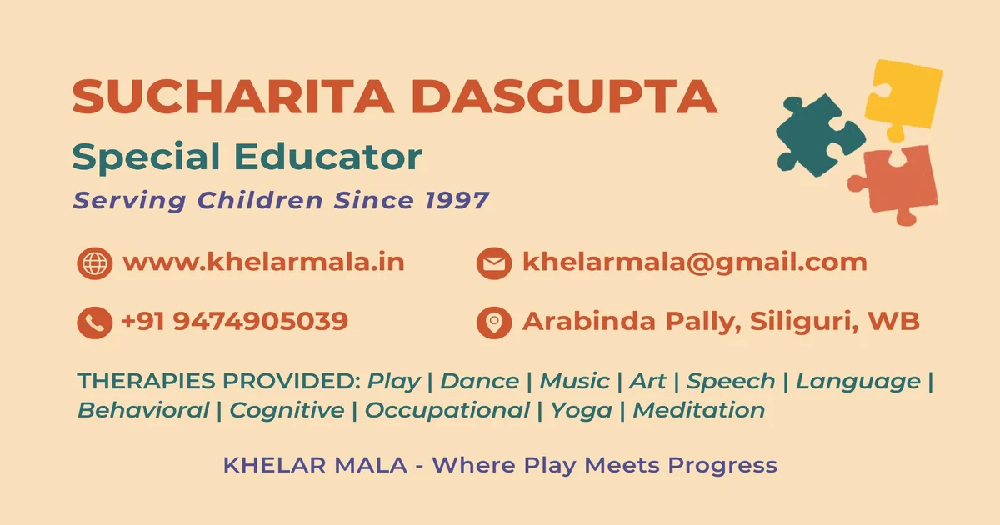

<div align="center">



<br/>
<br/>

# 🌿 Khelar Mala Intervention Centre

### *Where Play Meets Progress*

**North Bengal's most trusted special education & therapy centre — serving children since 1997**

<br/>

[](https://www.khelarmala.in)
[](https://www.khelarmala.in)
[](https://react.dev)
[](https://www.typescriptlang.org)
[](https://vite.dev)
[](https://tailwindcss.com)

<br/>

[](.)
[](https://www.khelarmala.in)
[](https://www.khelarmala.in/about)
[](https://www.khelarmala.in)

</div>

---

## 🏥 About Khelar Mala

**Khelar Mala Intervention Centre** is North Bengal's premier special education and child therapy centre, founded in **1997** by **Sucharita Dasgupta** — a dedicated special educator with over 27 years of experience. Located in the heart of Siliguri, Khelar Mala serves children with autism spectrum disorder (ASD), ADHD, Down Syndrome, developmental delays, speech challenges, and other special needs.

The name *"Khelar Mala"* means *"a garland of play"* — reflecting the centre's core philosophy that **play is the most powerful medium of learning and healing** for children.

> *"Every child has an inherent potential. Our role is to create the right environment for it to bloom."*
> — **Sucharita Dasgupta**, Founder & Director

---

## 🧩 Our Unique Approach — Play Therapy at the Core

Unlike conventional therapy centres, Khelar Mala uses **Play Therapy as the root** of all interventions. Every therapy branches from this holistic, joyful foundation:

```
                    🎮 PLAY THERAPY
                         │
    ┌──────┬──────┬───────┼───────┬──────┬──────┐
    │      │      │       │       │      │      │
   🎨    💃    🎵    🗣️    🗣️    🧠    🖐️    🧘
  Art  Dance Music Lang Speech Cogni  OT  Yoga
```

| Therapy | Description |
|---------|-------------|
| 🎨 **Art Therapy** | Creative expression to build emotional regulation and fine motor skills |
| 💃 **Dance Therapy** | Movement-based therapy to improve coordination, body awareness and joy |
| 🎵 **Music Therapy** | Rhythm and melody to enhance communication, memory and social bonding |
| 🗣️ **Language Therapy** | Building receptive and expressive language skills holistically |
| 🗣️ **Speech Therapy** | Targeted intervention for speech delay, articulation and fluency |
| 🧠 **Cognitive Therapy** | Strengthening attention, memory, reasoning and learning capabilities |
| 🖐️ **Occupational Therapy** | Developing daily life skills, sensory integration and fine motor control |
| 🤸 **Behavioural Therapy** | Evidence-based ABA and behaviour management strategies |
| 🧘 **Yoga & Meditation** | Building body-mind connection, self-regulation and inner calm |

---

## 👩‍⚕️ Founder & Director

<table>
<tr>
<td width="200">


</td>
<td>

### Sucharita Dasgupta
**Special Educator | Founder & Director**

With over **27 years of dedicated service** to children with special needs, Sucharita Dasgupta has built Khelar Mala into North Bengal's most trusted intervention centre.

- 🎓 Specialist in Special Education & Play Therapy
- 🏆 27+ years of hands-on experience
- 💛 950+ children's lives positively impacted
- 📍 Based in Siliguri, serving all of North Bengal

</td>
</tr>
</table>

---

## 📍 Location & Contact

| Detail | Info |
|--------|------|
| 📍 **Address** | Arabinda Pally, Siliguri, West Bengal 734001, India |
| 📞 **Phone** | [+91 94749 05039](tel:+919474905039) |
| 📧 **Email** | [khelarmala@gmail.com](mailto:khelarmala@gmail.com) |
| 🌐 **Website** | [www.khelarmala.in](https://www.khelarmala.in) |
| 🕐 **Hours** | Monday – Saturday, 10:00 AM – 8:00 PM IST |
| 💬 **WhatsApp** | [Chat with us](https://wa.me/919474905039) |

### 🗺️ Find Us
[](https://maps.app.goo.gl/tiLnH18U23SokhN58)

---

## 🌐 Connect With Us

[](https://www.instagram.com/khelarmala)
[](https://www.facebook.com/share/1FZMHwKAJJ/)
[](https://x.com/khelarmala)
[](https://wa.me/919474905039)

---

## 💻 Tech Stack

This website is built with a modern, performant, and accessible tech stack:

### Core
| Technology | Version | Purpose |
|-----------|---------|---------|
| ⚛️ React | 18.3 | UI framework |
| 🔷 TypeScript | 5.9 | Type safety |
| ⚡ Vite | 7.3 | Build tool & dev server |
| 🎨 Tailwind CSS | 3.4 | Utility-first styling |
| 🎭 Framer Motion | 12 | Animations & transitions |

### UI Components
| Technology | Purpose |
|-----------|---------|
| shadcn/ui | Accessible component library |
| Radix UI | Headless UI primitives |
| Lucide React | Icon library |
| class-variance-authority | Component variants |

### Forms & Validation
| Technology | Purpose |
|-----------|---------|
| React Hook Form | Form state management |
| Zod | Schema validation |
| Formspree | Form submissions & email delivery |

### SEO & Meta
| Technology | Purpose |
|-----------|---------|
| React Helmet Async | Dynamic `<head>` management |
| Schema.org JSON-LD | Structured data (LocalBusiness) |
| Open Graph | Social media previews |
| Canonical URLs | Duplicate content prevention |
| Sitemap XML | Search engine indexing |

### Analytics & Tracking
| Platform | Purpose |
|---------|---------|
| Google Analytics 4 | Traffic & behaviour analytics |
| Google Ads | Paid search conversion tracking |
| Meta Pixel | Facebook/Instagram ad tracking |

### Infrastructure
| Technology | Purpose |
|-----------|---------|
| ☁️ Cloudflare Pages | Hosting & global CDN (300+ PoPs) |
| 🔒 Cloudflare SSL | Free HTTPS & DDoS protection |
| GitHub | Version control & CI/CD |

---

## 🚀 Getting Started (Local Development)

### Prerequisites
- Node.js 18+
- npm 9+

### Installation

```bash
# Clone the repository
git clone https://github.com/khelarmala/Khelar-Mala.git
cd Khelar-Mala

# Install dependencies
npm install

# Start development server
npm run dev
```

The dev server will start at `http://localhost:5173`

### Available Scripts

```bash
npm run dev        # Start development server
npm run build      # Production build → /dist
npm run preview    # Preview production build locally
npm run lint       # Run ESLint
```

---

## 📁 Project Structure

```
khelar-mala-website/
├── public/
│   ├── _headers          # Cloudflare/Netlify security headers
│   ├── sitemap.xml       # SEO sitemap
│   ├── robots.txt        # Search engine directives
│   ├── og-image.webp     # Social share image
│   └── site.webmanifest  # PWA manifest
├── src/
│   ├── assets/           # Optimised WebP images
│   ├── components/
│   │   ├── layout/       # Header, Footer, MobileCTABar
│   │   ├── sections/     # Hero, Therapies, Founder, etc.
│   │   └── ui/           # shadcn/ui components
│   ├── lib/
│   │   ├── constants.ts  # Site config (phone, email, URLs)
│   │   └── animations.ts # Framer Motion variants
│   ├── pages/
│   │   ├── Index.tsx     # Home page
│   │   ├── About.tsx     # About & founder story
│   │   ├── Therapies.tsx # All therapy services
│   │   ├── Children.tsx  # Who we help
│   │   ├── Approach.tsx  # Our methodology
│   │   └── Contact.tsx   # Contact form & map
│   └── index.css         # Global styles & CSS variables
├── index.html            # Entry point (GA4 + Google Ads + Meta Pixel)
├── vite.config.ts        # Vite configuration
├── tailwind.config.ts    # Tailwind theme
└── tsconfig.json         # TypeScript config
```

---

## 🔒 Security

This website implements industry-standard security hardening:

- ✅ **Content Security Policy (CSP)** — restricts script/style/frame sources
- ✅ **X-Frame-Options: DENY** — prevents clickjacking
- ✅ **X-Content-Type-Options: nosniff** — prevents MIME sniffing
- ✅ **Referrer-Policy** — controls referrer information
- ✅ **Permissions-Policy** — disables unused browser APIs
- ✅ **Cloudflare DDoS Protection** — enterprise-grade, automatic
- ✅ **HTTPS enforced** — free SSL via Cloudflare
- ✅ **0 known CVEs** — regular `npm audit` checks

---

## ⚡ Performance

| Metric | Target |
|--------|--------|
| Lighthouse Performance | 90+ |
| First Contentful Paint | < 1.5s |
| Largest Contentful Paint | < 2.5s |
| Cumulative Layout Shift | < 0.1 |
| Time to Interactive | < 3.0s |

**Optimisations applied:**
- All images converted to WebP (avg 85% size reduction)
- Code splitting into 20+ lazy-loaded chunks
- Preconnect hints for all third-party origins
- Tailwind CSS purged (only used classes in bundle)
- Vite production minification + tree shaking

---

## 📄 Pages

| Page | Route | Description |
|------|-------|-------------|
| 🏠 Home | `/` | Hero, therapies overview, founder intro |
| ℹ️ About | `/about` | Full story, mission, milestones |
| 🧩 Therapies | `/therapies` | All 9 therapy services |
| 👶 Children | `/children` | Who we help & conditions |
| 🌱 Approach | `/approach` | Our Play Therapy methodology |
| 📞 Contact | `/contact` | Enquiry form, map, WhatsApp |

---

## 🚢 Deployment

This site is deployed on **Cloudflare Pages** with automatic CI/CD:

1. Push to `main` branch on GitHub
2. Cloudflare Pages auto-triggers a build
3. Runs `npm run build` → outputs to `dist/`
4. Deploys to Cloudflare's global network (300+ edge locations)
5. Live at [khelarmala.in](https://www.khelarmala.in) within ~60 seconds

---

## ❤️ Acknowledgements

Built with care for the children and families of North Bengal. Every pixel of this website exists to help one more child find their path to progress.

---

<div align="center">

**Khelar Mala Intervention Centre**
Arabinda Pally, Siliguri, West Bengal 734001

[🌐 Website](https://www.khelarmala.in) · [📞 Call](tel:+919474905039) · [💬 WhatsApp](https://wa.me/919474905039) · [📧 Email](mailto:khelarmala@gmail.com)

*"Every child is a different kind of flower, and altogether make this world a beautiful garden."*

</div>
